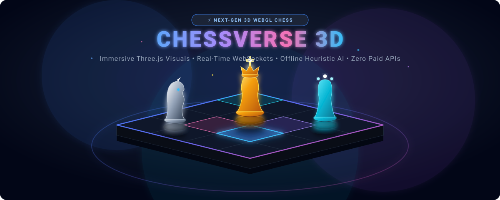
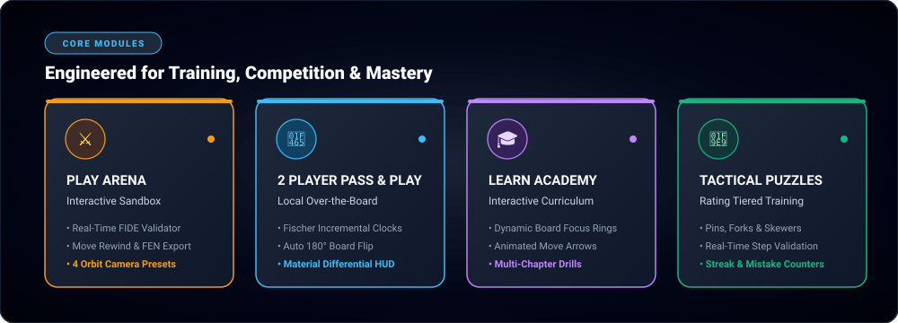
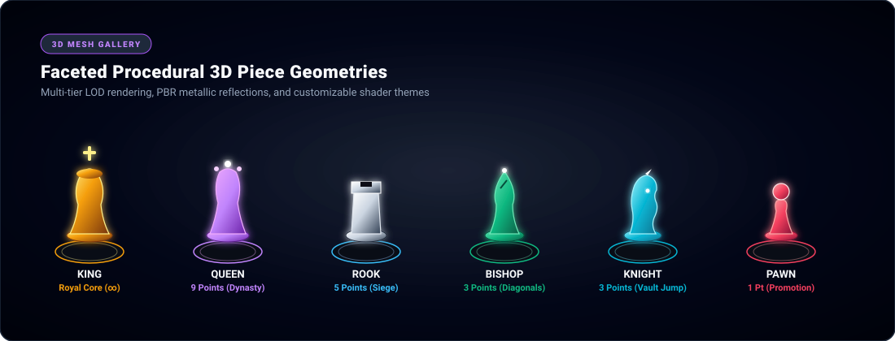
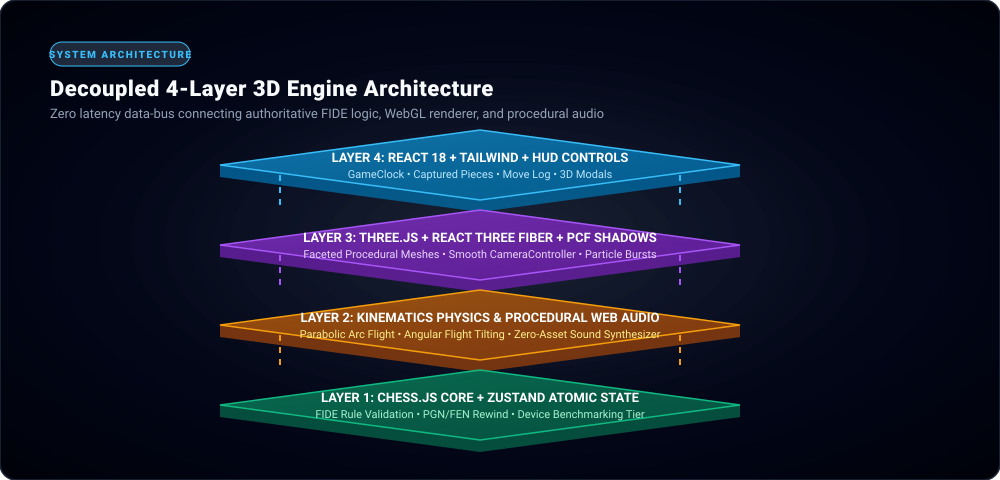

<div align="center">

# ⚡ CHESSVERSE 3D
### *Next-Generation 3D WebGL Chess Universe, Interactive Academy & Local Arena*

[](https://threejs.org/)
[](https://reactjs.org/)
[](https://www.typescriptlang.org/)
[](https://vitejs.dev/)
[](https://tailwindcss.com/)
[](LICENSE)

<br/>

<!-- HERO ANIMATED 3D BANNER -->
<p align="center">
  
</p>

<p align="center">
  <b>Cinematic 3D WebGL Chessboard • Parabolic Flight Physics • Interactive 3D Academy • Local Pass & Play • 100% Free & Self-Contained</b>
</p>

<p align="center">
  <a href="#-animated-modes-console">🕹️ Core Modes</a> •
  <a href="#-3d-physics--kinematics-engine">🚀 Flight Kinematics</a> •
  <a href="#-procedural-3d-mesh-gallery">🎲 3D Mesh Gallery</a> •
  <a href="#-system-architecture">🏛️ Architecture</a> •
  <a href="#-quick-start">⚡ Quick Start</a> •
  <a href="#-camera-controls--shortcuts">🎥 Camera &amp; Controls</a> •
  <a href="#-hardware-tiering--performance">📊 Performance</a>
</p>

---

</div>

## 🌟 Highlights & Capabilities

- 🎲 **Cinematic 3D Scene Graph**: Rendered via **Three.js** and **React Three Fiber** featuring procedural faceted pieces, dynamic point lights, soft `PCFShadowMap` shadowing, subtle atmospheric particles, and real-time board reflections.
- 🚀 **Parabolic Jump Kinematics**: Realistic flight arcs with vertical lift, directional tilt along the move vector, altitude-scaled ground shadows, and damped landing impacts.
- 🎥 **Smooth Orbital Camera Controller**: Smooth camera interpolations, free 360° orbital rotation, pan & zoom, and 4 one-click perspective presets (White, Black, 2D Tactical Top-Down, and Cinematic Orbit).
- 👥 **Dedicated 2-Player Pass & Play Arena**: Side-by-side battle station with configurable dual Fischer chess clocks (Bullet, Blitz, Rapid, Classical, Custom), turn-based 180° auto board flipping, live material count differentials, and captured piece graveyards.
- 🎓 **Interactive 3D Chess Academy**: Multi-chapter curriculum covering Fundamentals, Tactics, Openings, and Endgames with 3D board focus rings, animated move guide arrows, step explanations, and interactive validation.
- 🧩 **Rating-Tiered Tactical Puzzles**: Curated tactical puzzle library (Pins, Forks, Skewers, Discovered Attacks, Mate-in-2) with step verification, mistake detection, hint visualization, and solve streaks.
- 🎨 **Board & Piece Material Studio**: Live interactive 3D studio previewing 5 board themes (*Midnight Onyx, Royal Walnut, Cyber Grid, Classic Tournament, Emerald Forest*) and 4 piece materials (*Alabaster, Obsidian, Gold Leaf, Brushed Metal*).
- 🎵 **Procedural Web Audio Engine**: 100% synthesized soundscape using the Web Audio API—zero MP3/WAV assets to load. Dynamic sound effects for slides, captures, checks, promotions, clock ticks, and checkmate.
- ⚡ **Adaptive Hardware Benchmarking**: Automated GPU tier detection dynamically configures shadow mapping, particle counts, and device pixel ratio (DPR) to guarantee 60 FPS on any device.

---

## 🕹️ Animated Modes Console

<!-- ANIMATED MODES CARDS GRAPHIC -->
<p align="center">
  
</p>

| Mode | Target Experience | Key Engine Capabilities |
| :--- | :--- | :--- |
| **⚔️ PLAY ARENA** | Solo Sandbox &amp; Engine Practice | Real-time FIDE legality validation, pawn promotion modal, interactive move rewind slider, and FEN/PGN clipboard export. |
| **👥 2 PLAYER** | Local Over-the-Board Play | Dedicated dual-seat layout, customizable Fischer chess clocks with increments, auto-flipping board orientation, and full move history. |
| **🎓 LEARN ACADEMY** | Guided 3D Masterclasses | Step-by-step interactive lessons with 3D board target rings, animated trajectory vectors, contextual hints, and persistent study streaks. |
| **🧩 TACTICAL PUZZLES** | Pattern Recognition Drill | Curated rating tiers from 800 to 2200 ELO with step validation, mistake counters, visual hint overlays, and tactical categories. |
| **👤 PLAYER PROFILE** | Verifiable Local Career Record | Persistent tracking of Games Played, Wins, Losses, Draws, Lessons Completed, Puzzles Solved, Win Streaks, and Course Progress. |
| **🎨 THEMES STUDIO** | Visual Customization Sandbox | Live rotating 3D preview of board woodgrains, carbon-fiber inlays, metallic shaders, and ambient neon edge lighting. |

---

## 🚀 3D Physics &amp; Kinematics Engine

<!-- ANIMATED 3D PHYSICS TRAJECTORY GRAPHIC -->
<p align="center">
  
</p>

ChessVerse 3D abandons flat, sliding piece movements in favor of a true **3D kinematic flight simulation**:

### 1. Parabolic Flight Curve
When a piece moves between square coordinates $(x_0, z_0)$ and $(x_1, z_1)$, its altitude $y(t)$ follows a smooth sinusoidal parabolic trajectory:

$$y(t) = h_{\text{lift}} + h_{\text{max}} \cdot \sin(\pi \cdot t) \quad \text{for } t \in [0, 1]$$

- **$h_{\text{lift}}$**: Initial vertical clearance ($0.42$ board units) to prevent collisions with adjacent pieces.
- **$h_{\text{max}}$**: Apex height ($0.85$ board units) scaling with Manhattan distance $\Delta d = |x_1 - x_0| + |z_1 - z_0|$.

### 2. Angular Tilt Dynamics
Pieces dynamically pitch and roll according to their directional velocity vector:

$$\theta_{\text{tilt}}(t) = -(\Delta x \cdot \mathbf{i} + \Delta z \cdot \mathbf{k}) \cdot \sin(\pi \cdot t) \cdot 0.12$$

### 3. Dynamic Drop Shadows
The ground contact shadow dynamically scales down in radius and decreases opacity as the piece rises to its apex, providing depth cues:

$$\text{Shadow Radius}(t) = r_0 \cdot \left(1.0 - 0.55 \cdot \frac{y(t)}{h_{\text{max}}}\right)$$

### 4. Damped Landing Impact & Procedural Audio
Upon arrival ($t = 1.0$), a subtle damped spring settles the piece into the square matrix while the Web Audio synthesizer emits a crisp, wooden resonance impulse.

---

## 🎲 Procedural 3D Mesh Gallery

<!-- ANIMATED 3D PIECES SHOWCASE GRAPHIC -->
<p align="center">
  
</p>

All 3D chess pieces are procedurally modeled using optimized Three.js geometries, eliminating the latency of multi-megabyte GLTF file downloads:

| Piece | Procedural Construction | LOD Budget | Special 3D Animations |
| :---: | :--- | :---: | :--- |
| **♔ King** | Tiered cylinder base, tapered Lathe body, cross finial with neon core | 380 polys | Royal halo focus pulse on check / checkmate |
| **♕ Queen** | Fluted Lathe column, multi-point coronet with specular spherical gems | 420 polys | Majestic levitation bobbing during promotion |
| **♖ Rook** | Heavy stone plinth, cylindrical castle tower, crenellated parapet | 310 polys | Castle slide-vault during kingside/queenside castling |
| **♗ Bishop** | Stepped base, mitre cleft geometry, teardrop finial top | 290 polys | Diagonal highlight sweep across board squares |
| **♘ Knight** | Chamfered pedestal, sculpted equine silhouette, mane ridge &amp; snout | 490 polys | Characteristic vaulting arc jumping over intervening pieces |
| **♙ Pawn** | Weighted conical base, collar ring, sphere head with specular highlight | 210 polys | En passant capture swoosh &amp; 8th-rank promotion bloom |

---

## 🏛️ System Architecture

<!-- ANIMATED ARCHITECTURE 3D STACK GRAPHIC -->
<p align="center">
  
</p>

```
┌────────────────────────────────────────────────────────────────────────┐
│                      LAYER 4: USER INTERFACE & HUD                     │
│    React 18 • Tailwind CSS • Dual Clocks • Move Log • 3D Modals        │
└──────────────────────────────────┬─────────────────────────────────────┘
                                   │ Event Dispatch
┌──────────────────────────────────▼─────────────────────────────────────┐
│                    LAYER 3: 3D WEBGL GRAPHICS PIPELINE                 │
│ Three.js (r183) • React Three Fiber • PCFShadowMap • OrbitControls     │
└──────────────────────────────────┬─────────────────────────────────────┘
                                   │ Kinematic Hooks
┌──────────────────────────────────▼─────────────────────────────────────┐
│               LAYER 2: KINEMATICS & PROCEDURAL AUDIO                   │
│ Parabolic Arc Trajectories • Spring Dampers • Web Audio Synthesizer    │
└──────────────────────────────────┬─────────────────────────────────────┘
                                   │ Reactive State Sync
┌──────────────────────────────────▼─────────────────────────────────────┐
│                   LAYER 1: AUTHORITATIVE FIDE CORE                     │
│     chess.js Rules Engine • Zustand Atomic Store • Local Storage       │
└────────────────────────────────────────────────────────────────────────┘
```

---

## 🎥 Camera Controls &amp; Shortcuts

ChessVerse 3D includes a responsive OrbitController with intelligent keyboard shortcuts:

| Key / Gesture | Action | Description |
| :---: | :--- | :--- |
| <kbd>Left Click + Drag</kbd> | **Orbit Camera** | Freely rotate the 3D board around its center axis |
| <kbd>Right Click + Drag</kbd> | **Pan Camera** | Translate camera target along the horizontal plane |
| <kbd>Scroll Wheel</kbd> | **Zoom In / Out** | Smooth FOV dolly zoom with distance boundaries |
| <kbd>1</kbd> | **White Perspective** | Standard default vantage point from White's side |
| <kbd>2</kbd> | **Black Perspective** | 180° inverted vantage point from Black's side |
| <kbd>3</kbd> | **Top-Down 2D View** | Pure orthogonal overhead angle for analytical study |
| <kbd>4</kbd> | **Cinematic Orbit** | Continuous slow 360° rotational camera drift |
| <kbd>Space</kbd> | **Reset Camera** | Snaps the camera back to default angle smoothly |
| <kbd>Z</kbd> | **Undo Move** | Rewind previous move in practice / sandbox mode |
| <kbd>F</kbd> | **Flip Board** | Inverts the board 180° instantly |

---

## 📊 Hardware Tiering &amp; Performance

The built-in benchmark system automatically detects the client's GPU capabilities and adjusts settings dynamically:

```
                GPU BENCHMARK INITIALIZATION
                             │
            ┌────────────────┴────────────────┐
            ▼                                 ▼
   [WebGL 2.0 Supported]            [WebGL Unsupported]
            │                                 │
   Render 5 Test Frames             Fallback to Accessible
   Measure Frame Delta               2D SVG Board Canvas
            │
   ┌────────┴────────┬────────────────┐
   ▼                 ▼                ▼
[HIGH TIER]     [MEDIUM TIER]     [LOW TIER]
DPR: 1.5 - 2.0  DPR: 1.0 - 1.25   DPR: 1.0
Soft PCF Shadows Hard Shadows      No Shadows
Dust Particles  50% Particles     Particles Off
Full Shaders    Basic Shaders     Low Power GPU
```

---

## ⚡ Quick Start

### Prerequisites
- [Node.js](https://nodejs.org/) (version **18.0** or later)
- [npm](https://www.npmjs.com/) (version **9.0** or later)

### 1. Clone the repository
```bash
git clone https://github.com/your-username/chessverse-3d.git
cd chessverse-3d
```

### 2. Install dependencies
```bash
npm install
```

### 3. Start development server
```bash
npm run dev
```
Open **http://localhost:3000** in your browser.

### 4. Build for production
```bash
npm run build
npm run preview
```

---

## 📁 Repository Structure

```
chessverse-3d/
├── assets/                       # Animated 3D SVG Graphics for GitHub README
│   ├── banner.svg                # Animated 3D Hero Banner
│   ├── modes-showcase-3d.svg     # Animated 3D Core Game Modes Console
│   ├── physics-trajectory-3d.svg # Animated Parabolic Trajectory Diagram
│   ├── pieces-showcase-3d.svg    # Animated 3D Procedural Mesh Gallery
│   └── architecture-3d.svg       # Animated 4-Layer Engine Architecture
├── public/                       # Static public assets & PWA manifest
├── src/
│   ├── 3d/                       # Three.js & React Three Fiber components
│   │   ├── ChessCanvas.tsx       # Primary 3D WebGL Canvas with OrbitControls
│   │   ├── AnimatedPiece.tsx     # Parabolic flight kinematics & piece mesh
│   │   ├── Board3D.tsx           # PBR board shaders, coordinate laser lines
│   │   ├── CameraController.tsx  # Smooth camera transition interpolations
│   │   ├── ParticleField.tsx     # Ambient atmospheric dust simulation
│   │   └── ThemePreview3D.tsx    # Live rotating 3D theme studio stage
│   ├── components/               # React UI & HUD component suite
│   │   ├── ui/Navbar.tsx         # Unified 6-destination responsive navigation
│   │   ├── landing/HeroSection.tsx # 3D Landing command console
│   │   └── ui/Button3D.tsx       # Physics-pressed 3D tactile buttons
│   ├── pages/                    # Core view modules
│   │   ├── PlayView.tsx          # 3D Solo / Practice Sandbox
│   │   ├── TwoPlayerView.tsx     # Local Pass & Play dual-clock arena
│   │   ├── LearnView.tsx         # Interactive 3D Academy
│   │   ├── PuzzlesView.tsx       # Tactical Puzzle Drills
│   │   └── ProfileView.tsx       # Verifiable Career Record
│   ├── services/
│   │   ├── audio.ts              # Procedural Web Audio synthesizer
│   │   ├── benchmark.ts          # GPU capability benchmark & tiering
│   │   └── storage.ts            # Persistent local stats engine
│   └── store/
│       ├── gameStore.ts          # Zustand atomic chess game state
│       └── settingsStore.ts      # Audio, graphics & camera configurations
└── package.json
```

---

## 🤝 Contributing

Contributions, feedback, and pull requests are welcome!

1. Fork the Project
2. Create your Feature Branch (`git checkout -b feature/Epic3DFeature`)
3. Commit your Changes (`git commit -m 'Add new 3D theme shader'`)
4. Push to the Branch (`git push origin feature/Epic3DFeature`)
5. Open a Pull Request

---

## 📄 License

Distributed under the **MIT License**. See `LICENSE` for more information.

<div align="center">
  <sub>Engineered with precision for chess enthusiasts, learners, and grandmasters worldwide.</sub>
</div>
